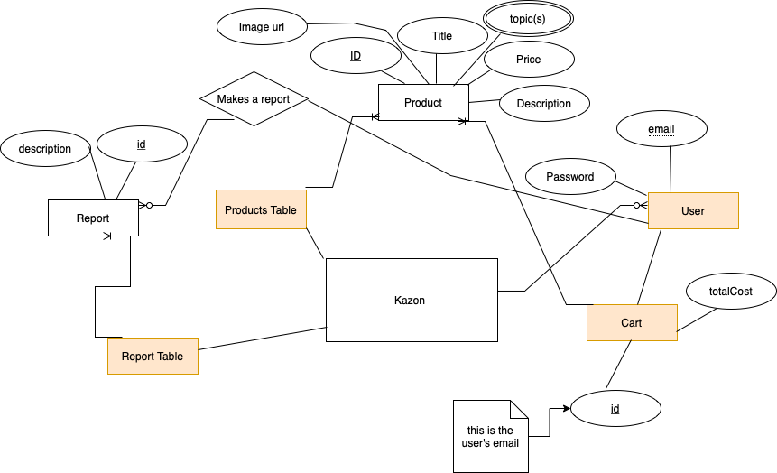

# Kazon Backend

## Backend REST api that implements the CRUD model. Tech stack is PostgreSQL 15, Express.js and, Node.js

## Database ER model


## To run

### Make a database "kazonDB" and run createDB.sql to initialize the tables
### Create a credentials.json in src/, for the db credentials
### Create .env in root folder for the 'ACCESS_TOKEN_SECRET'
### Run commands below
```
npm install
npm run devStart
```